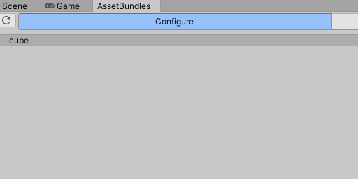
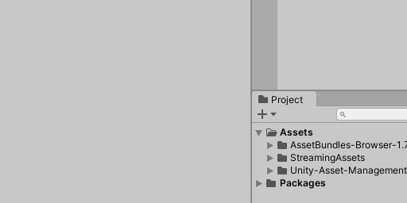

# Unity-AssetManagement-Tool

---

 这是一个简单的资源管理工具，可用于异步加载/释放资源。

## 特点

- 引用计数，自动释放资源

- 异步加载/释放，队列执行

## 依赖
- [AssetBundles Browser](https://github.com/Unity-Technologies/AssetBundles-Browser)（已导入）

## 使用教程

### 0-1. 使用AssetBundleBrowser来设置资源的AssetBundleName


### 0-2. 使用AssetBundleBrowser打包AssetBundles



### 1. 预处理（导出AssetBundleManifest.txt文件）


```
Settings.asset上可以设置相关路径
```

### 2. 测试例子



```

// LoadCube.cs

// 资源路径（选中资源右键菜单，选Copy Path，就可以复制资源路径到剪切板）
public string assetPath = "Assets/Unity-AssetManagement-Tool/Example/Prefab/Cube.prefab";

// 加载AssetBundleManifest.txt内容
string json = Resources.Load<TextAsset>("AssetBundleManifest").text;
var manifest = JsonUtility.FromJson<AssetBundleManifest>(json);

// 设置AssetBundleManifest
AssetManagementTool.Instance.SetAssetBundleManifest(manifest)

// 默认情况下，AssetBundle的父目录名字为AssetBundles，
// 但例子中AssetBundle没特定名字的父目录，
// 所以这里需要把AssetBundle的父目录设置为空，否则会报错，并打印错误的路径
.SetAssetBundlesFolder(string.Empty)

// 异步加载接口
.LoadAssetAsync<GameObject>(assetPath, asset => {
    if (asset == null) {
        // 加载资源失败
    } else {
    		// 加载资源成功
        Instantiate(asset);
    }
}).UnloadAssetAsync(assetPath); // 异步卸载接口
                
```

## 其他

```
1. 只支持通过资源路径来加载资源
2. LoadAssetAsyncs和UnloadAssetAsync，支持传入路径列表来加载或卸载多个资源
3. 我的Unity5.6.7已经打不开了，所以把项目的Unity版本升级到Unity2021.2.0a21了
```


